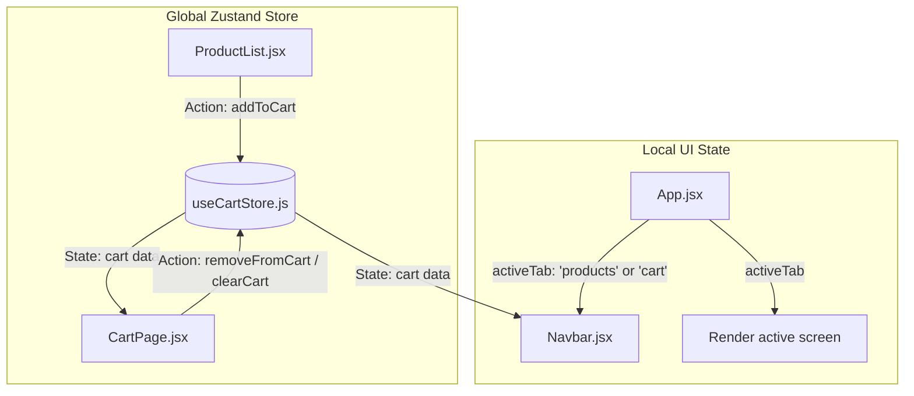

# Implementation Plan: React & Zustand Cart Application

We will build a simple, beautiful React application using **Zustand** for state management. The application will feature:
1. A **Product Catalog** where users can browse products and click "Add to Cart".
2. A **Cart Page / Drawer** showing the added items, quantities, subtotal, and controls to modify/remove items or clear the cart.
3. Modern, premium UI design using Vanilla CSS, complete with hover micro-animations, glassmorphic elements, and a clean layout.
4. **Comprehensive comments and annotations** explaining the flow of local state, global state, and Zustand state updates.

---

## State Flow Concept: Local vs. Global (Zustand)

To understand this application, it is important to distinguish between **Local Component State** and **Global Store State (Zustand)**:



### 1. Local State Flow
- **Definition**: State that is private and isolated to a specific component.
- **Example in this app**: The active screen state (`activeTab` in `App.jsx`, which toggles between the Product Catalog and the Cart page). It is managed via React's standard `useState` because other parts of the app do not need to read or manipulate it directly.

### 2. Global State Flow (Zustand)
- **Definition**: Shared state accessed by multiple disconnected components.
- **Example in this app**: The `cart` array.
  - **ProductList.jsx** needs to write to the cart (triggering `addToCart`).
  - **Navbar.jsx** needs to read the cart to show the badge count (e.g., `cart.length` or total quantity).
  - **CartPage.jsx** needs to read and write to the cart (listing items, updating quantities, removing items).
- **Zustand's Reactive Flow**:
  1. **Component Subscribes**: A component calls `useCartStore(state => state.cart)`. Zustand registers this component to re-render whenever `cart` changes.
  2. **Action Dispatched**: When a user clicks "Add to Cart", the component invokes `addToCart(product)`.
  3. **Store Updates**: Inside the store, the action updates the store's state using `set()`.
  4. **Automatic Re-renders**: Zustand efficiently notifies only the subscribed components (e.g., Navbar and CartPage), triggering a UI update.

---

## Proposed Changes

### 1. Configuration & Initial Setup

#### [NEW] [package.json](file:///c:/Users/celine%20gouw/OneDrive/Documents/dumetschools/pertemuan%206/package.json)
Standard dependencies including `react`, `react-dom`, `zustand`, and devDependencies like `vite` and `@vitejs/plugin-react`.

#### [NEW] [vite.config.js](file:///c:/Users/celine%20gouw/OneDrive/Documents/dumetschools/pertemuan%206/vite.config.js)
Standard Vite configuration for React.

#### [NEW] [index.html](file:///c:/Users/celine%20gouw/OneDrive/Documents/dumetschools/pertemuan%206/index.html)
Root HTML file linking `src/main.jsx` and importing modern Google Fonts (e.g., *Plus Jakarta Sans* or *Outfit*).

---

### 2. State & Data Layer

#### [NEW] [useCartStore.js](file:///c:/Users/celine%20gouw/OneDrive/Documents/dumetschools/pertemuan%206/src/store/useCartStore.js)
This file houses the **Zustand Global Store**. It manages the cart array and exposes actions to modify it.

```javascript
import { create } from "zustand";

/**
 * Global Zustand Store definition.
 * - 'set' is used to merge new values into the store's state.
 * - 'get' is used to read the current state inside actions.
 */
export const useCartStore = create((set, get) => ({
  // --- GLOBAL STATE ---
  cart: [], // Stores cart items. Structure: [{ id, name, price, qty, image }]

  // --- ACTIONS (MUTATIONS) ---

  /**
   * Action: Add product to cart, or increment quantity if it already exists.
   * Flow: Read current cart -> Search for item -> Update or Append -> Notify subscribers.
   */
  addToCart: (product) => {
    const cart = get().cart; // Read current global cart array
    const existing = cart.find((item) => item.id === product.id);

    if (existing) {
      // Flow: If product is already in cart, increment quantity
      set({
        cart: cart.map((item) =>
          item.id === product.id ? { ...item, qty: item.qty + 1 } : item
        ),
      });
    } else {
      // Flow: If product is new, append it to the cart with initial qty: 1
      set({
        cart: [...cart, { ...product, qty: 1 }],
      });
    }
  },

  /**
   * Action: Remove a product from the cart by its ID.
   * Flow: Filter out the item matching the ID -> Set new state -> Notify subscribers.
   */
  removeFromCart: (id) => {
    set({
      cart: get().cart.filter((item) => item.id !== id),
    });
  },

  /**
   * Action: Clear all products from the cart.
   * Flow: Reset cart to an empty array -> Set new state -> Notify subscribers.
   */
  clearCart: () => {
    set({ cart: [] });
  },
}));
```

#### [NEW] [products.js](file:///c:/Users/celine%20gouw/OneDrive/Documents/dumetschools/pertemuan%206/src/data/products.js)
Mock products with name, price, description, image, and category to populate the store UI.

---

### 3. Components & UI Layer

#### [NEW] [Navbar.jsx](file:///c:/Users/celine%20gouw/OneDrive/Documents/dumetschools/pertemuan%206/src/components/Navbar.jsx)
A header that displays the logo, active tab (Products vs. Cart), and a cart icon indicating total items in the store.

- **Local state interaction**: Receives `activeTab` and `setActiveTab` as props to update the active page.
- **Global state interaction**: Subscribes to the global `cart` state to calculate and display the total number of items in the cart dynamically.

#### [NEW] [ProductList.jsx](file:///c:/Users/celine%20gouw/OneDrive/Documents/dumetschools/pertemuan%206/src/components/ProductList.jsx)
A grid displaying the product catalog. Each item has details and an "Add to Cart" button.

- **Global state interaction**: Calls the global action `addToCart` from `useCartStore` when a user clicks the "Add to Cart" button.

#### [NEW] [CartPage.jsx](file:///c:/Users/celine%20gouw/OneDrive/Documents/dumetschools/pertemuan%206/src/components/CartPage.jsx)
Displays the items currently in the cart.

- **Global state interaction**: 
  - Reads global state `cart` to render cart items.
  - Triggers actions `addToCart` (to increment quantity), `removeFromCart` (to delete or decrement items), and `clearCart` to reset the cart.

#### [NEW] [App.jsx](file:///c:/Users/celine%20gouw/OneDrive/Documents/dumetschools/pertemuan%206/src/App.jsx)
Manages the active view state (Products vs. Cart).

- **Local state interaction**: Uses standard React `useState` to toggle which page is visible (`activeTab`).

#### [NEW] [index.css](file:///c:/Users/celine%20gouw/OneDrive/Documents/dumetschools/pertemuan%206/src/index.css)
A highly premium CSS file using variables for custom color palettes (deep slates, vibrant indigo/violet accents), glassmorphic navbars, micro-animations on hover/click, and fully responsive layouts.

---

## Verification Plan

### Automated Verification
- Run `npm run build` to verify there are no compilation or syntax errors.

### Manual Verification
1. Start the Vite dev server (`npm run dev`).
2. Add multiple products to the cart and verify that:
   - Quantities update dynamically when the same product is added multiple times.
   - The navbar badge counts items correctly.
3. Go to the Cart Page and verify:
   - Item lists display correctly with images, names, quantities, and sub-prices.
   - Clicking "Remove" removes the specific item.
   - Clicking "Clear Cart" resets the cart to empty.
   - Subtotal is computed correctly.
